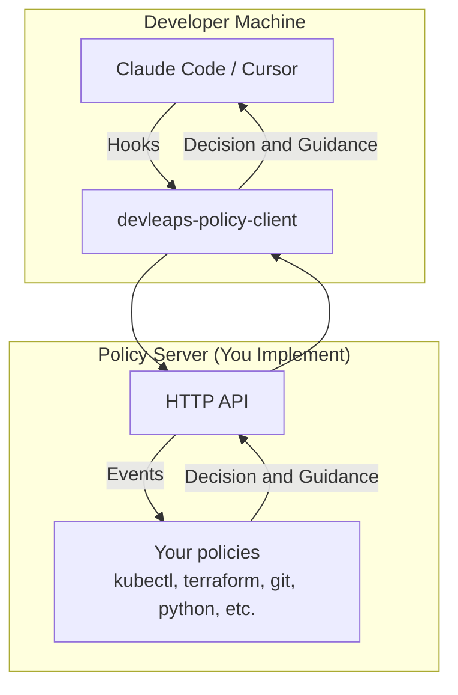

# AI Agent Policies

[](https://pypi.org/project/devleaps-agent-policies/)

Policies turn your [Cursor Rules](https://cursor.com/docs/context/rules) or [CLAUDE.md](https://docs.claude.com/en/docs/claude-code/memory) into hard guardrails which an AI Agent cannot simply ignore, or forget. They handle what to do when an agent wants to make a decision, along with other [hooks-supported events](https://github.com/Devleaps/agent-policies/blob/main/devleaps/policies/server/common/models.py). Policies can yield both decisions and guidance.

This framework supports **Claude Code**. Support for **Cursor** is in beta.

## Why Policies

### Automating Decisions

Rule files can be forgotten or ignored completely by LLMs. Policies are unavoidable:

```python
command = input_data.command.strip()

if command == "terraform apply":
    yield PolicyDecision(
        action=PolicyAction.DENY,
        reason="terraform apply is not allowed. Use `terraform plan` instead."
    )

if command == "terraform plan":
    yield PolicyDecision(action=PolicyAction.ALLOW)
```

In the image below, the agent is denied by policy from running `terraform apply`. The agent can then make decisions on what to do next, in this case it outputs that it will attempt a `terraform plan` as per the policy recommendation.

> 

### Automating Guidance

Aside from denying and allowing automatically, policies can also provide guidance through Post-* events:

```python
if comment_to_code_overlap >= 0.4:
    yield PolicyHelper.guidance(
        "Ensure comments add value beyond describing what's obvious from the code. "
        "This comment may be redundant with the code it describes."
    )
    return
```

In the image below, an agent makes a change which includes a comment that is detected as being potentially redundant. The guidance from the snippet is given as feedback to the change, after which the agent by itself decides to remove the redundant comment.

> 
This library provides the **client component** for policy enforcement. It forwards hook events from your editor to a policy server.

**To implement your own policy server:** Build a server that accepts events and returns policy decisions. This package provides the client, event types, and decision models. Server implementation (FastAPI app, policies, command parsing) is separate.

**Note:** As of v2.0, this package is client-only. For production policy servers, contact [DevLeaps](https://devleaps.nl).

## Architecture



## Quick Start

### Installation

Install from PyPI:

```bash
pip install devleaps-agent-policies
```

Or for development:

```bash
git clone https://github.com/Devleaps/agent-policies.git
cd agent-policies
```


### Configure Claude Code

Run the install command to automatically configure hooks:

```bash
devleaps-policy-client install
```

Or manually add `devleaps-policy-client` to your Claude Code hooks configuration in `~/.claude/settings.json`:

<details>
<summary>Click to expand Claude Code configuration</summary>

```json
{
  "hooks": {
    "PreToolUse": [
      {
        "hooks": [
          {
            "matcher": "*",
            "type": "command",
            "command": "devleaps-policy-client"
          }
        ]
      }
    ],
    "PostToolUse": [
      {
        "hooks": [
          {
            "matcher": "*",
            "type": "command",
            "command": "devleaps-policy-client"
          }
        ]
      }
    ],
    "UserPromptSubmit": [
      {
        "hooks": [
          {
            "matcher": "*",
            "type": "command",
            "command": "devleaps-policy-client"
          }
        ]
      }
    ],
    "Stop": [
      {
        "hooks": [
          {
            "matcher": "*",
            "type": "command",
            "command": "devleaps-policy-client"
          }
        ]
      }
    ],
    "SubagentStop": [
      {
        "hooks": [
          {
            "matcher": "*",
            "type": "command",
            "command": "devleaps-policy-client"
          }
        ]
      }
    ],
    "Notification": [
      {
        "hooks": [
          {
            "matcher": "*",
            "type": "command",
            "command": "devleaps-policy-client"
          }
        ]
      }
    ],
    "PreCompact": [
      {
        "hooks": [
          {
            "matcher": "*",
            "type": "command",
            "command": "devleaps-policy-client"
          }
        ]
      }
    ],
    "SessionStart": [
      {
        "hooks": [
          {
            "matcher": "*",
            "type": "command",
            "command": "devleaps-policy-client"
          }
        ]
      }
    ],
    "SessionEnd": [
      {
        "hooks": [
          {
            "matcher": "*",
            "type": "command",
            "command": "devleaps-policy-client"
          }
        ]
      }
    ]
  }
}
```

> [!WARNING]
> Be aware when automatically allowing that Bash tools use strings can invole more than one underlying tool. Consider also commands such as `find` having unsafe options like `-exec`.
</details>

### Configure Cursor

Run the install command to automatically configure hooks:

```bash
devleaps-policy-client install cursor
```

Or manually create or edit `~/.cursor/hooks.json`:

<details>
<summary>Click to expand Cursor configuration</summary>

```json
{
  "version": 1,
  "hooks": {
    "beforeShellExecution": [
      { "command": "devleaps-policy-client" }
    ],
    "beforeMCPExecution": [
      { "command": "devleaps-policy-client" }
    ],
    "afterFileEdit": [
      { "command": "devleaps-policy-client" }
    ],
    "beforeReadFile": [
      { "command": "devleaps-policy-client" }
    ],
    "beforeSubmitPrompt": [
      { "command": "devleaps-policy-client" }
    ],
    "stop": [
      { "command": "devleaps-policy-client" }
    ]
  }
}
```

The `devleaps-policy-client` command will forward hook events to the policy server running on `localhost:8338`.

> [!WARNING]
> Be aware when automatically allowing that Bash tools use strings can invole more than one underlying tool. Consider also commands such as `find` having unsafe options like `-exec`.
</details>

### Uninstall

To remove hooks from Claude Code:

```bash
devleaps-policy-client uninstall
```

To remove hooks from Cursor:

```bash
devleaps-policy-client uninstall cursor
```

This removes all `devleaps-policy-client` hooks from the respective editor configuration files.

## Sessions

Each Claude Code or Cursor session receives a unique `session_id`. Policies can use this to track context across multiple hook events within the same session, enabling stateful policy decisions. See the [session state utility](server-side session management in your implementation) to store and retrieve per-session data.

## Configuration

The client supports centralized configuration via JSON files:

**Home-level config** (`~/.agent-policies/config.json`):
```json
{
  "bundles": ["python", "git"],
  "editor": "claude-code",
  "server_url": "http://localhost:8338",
  "default_policy_behavior": "ask"
}
```

**Project-level config** (`.agent-policies/config.json`):
```json
{
  "bundles": ["terraform"]
}
```

Configuration is merged with project settings overriding home settings.

**Available fields:**
- `bundles`: List of enabled policy bundles (default: `[]`)
- `editor`: Editor name, ignored by client (default: `claude-code`)
- `server_url`: Policy server endpoint (default: `http://localhost:8338`)

## Policy Bundles

Policies can be organized into bundles to group related rules for specific workflows or project types. This allows you to compose different policy sets without having to manage separate server configurations.

**How bundles work:**
- Universal policies (registered with `bundle=None`) are always enforced
- Bundle-specific policies are only enforced when enabled in config
- Multiple bundles can be enabled: set `"bundles": ["bundle1", "bundle2"]` in config
- Bundles can coordinate through shared session state

Bundles are configured client-side and enforced server-side.

## Development

This project is built with [uv](https://docs.astral.sh/uv/).
